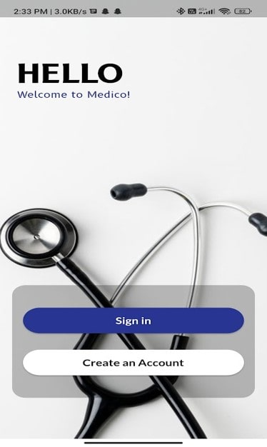
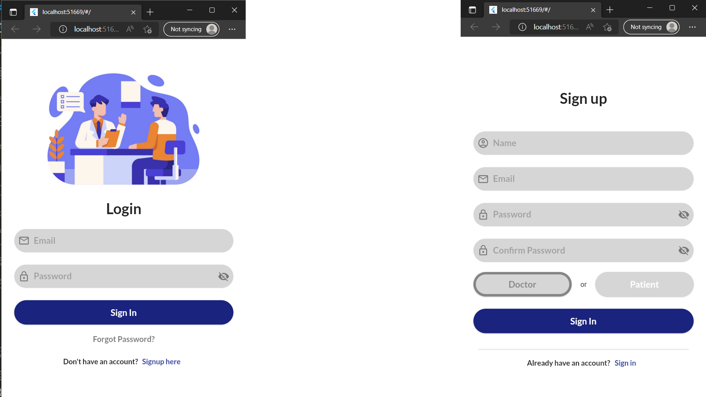
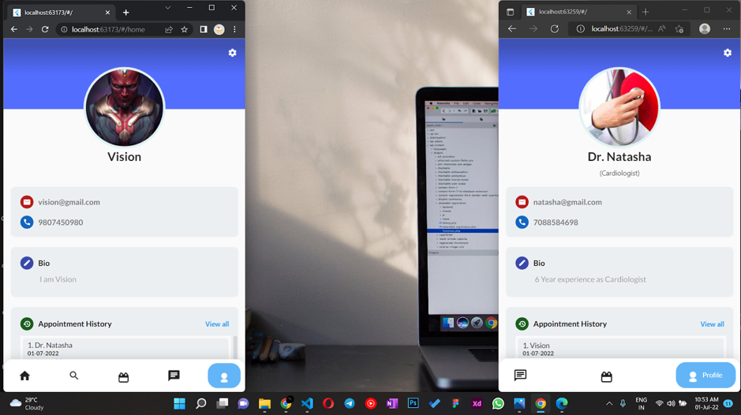
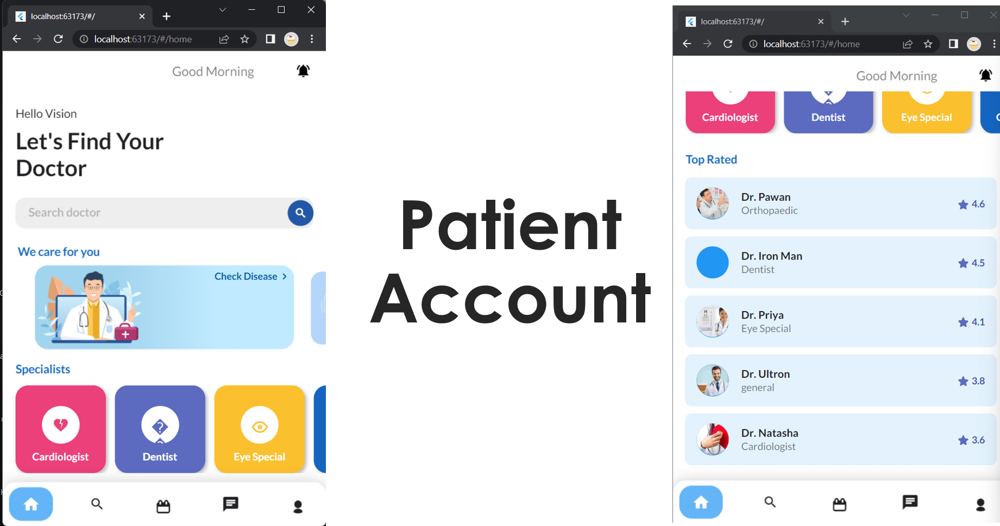
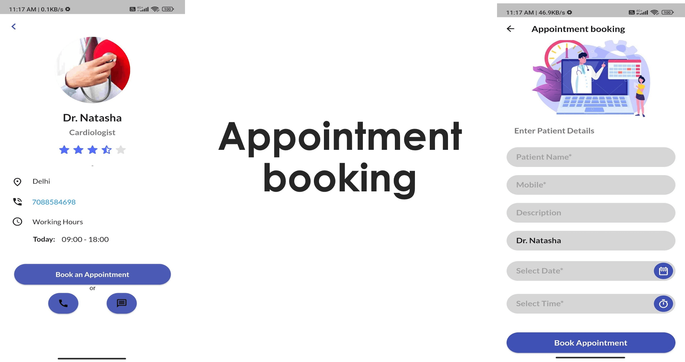
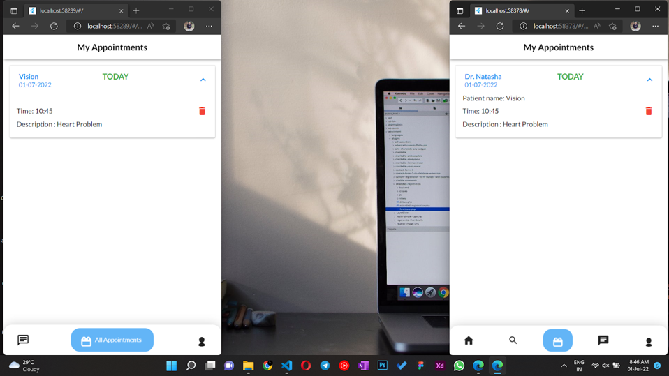
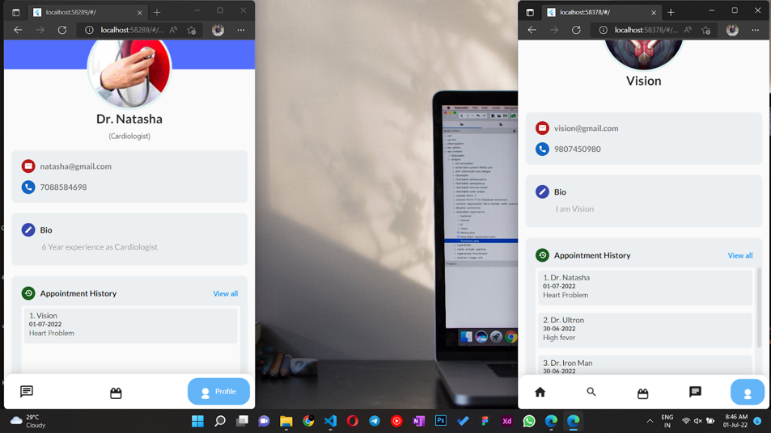
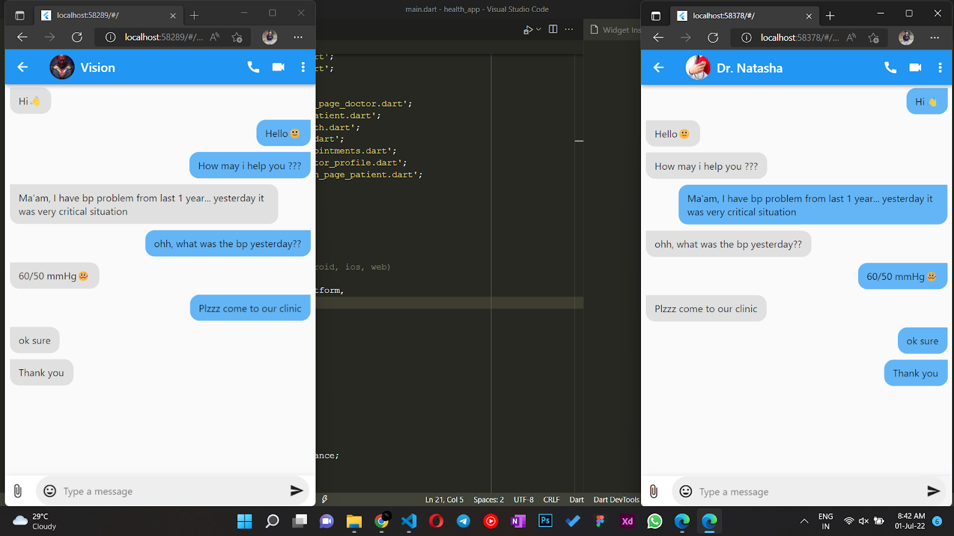
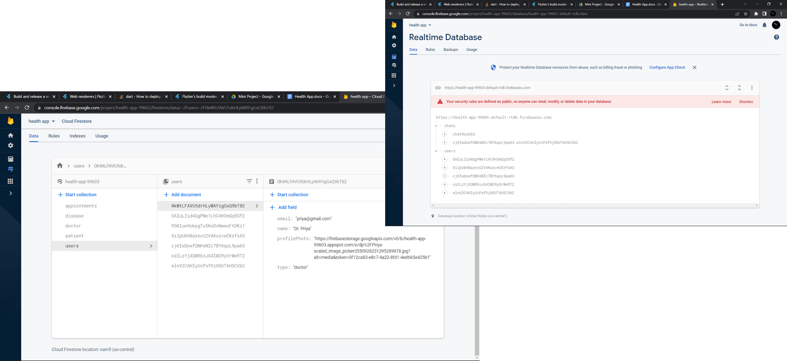

<h1 align="center"> Health-App </h1>

- Click on the above icon to open the app(web version).
- It is a Cross-Platform Application.
- Helps a patient to search doctor as per their need 
   - view complete profile of the doctor.
   - book an appointment with the doctor.
   - Call and message directly with the doctor.

- Helps Doctor to reach patient all over the world.

## Featues
- Common App for `patient` and `doctor`
- Doctor Searching
- Appointment Booking (cancelling & history also)
- Calling
- Realtime Chatting
- Easy to use

## Technologies Used
- Flutter
    - Dart language
    - Frontend + Backend
- Firebase
    - Authentication ------> for authentication of the user
    - Database -----> for storing the data of patient and doctor
    - Storage ------> for profile images
    - Realtime Database -------> for real time Chatting

## Screenshots
## 1. Start Screen

## 1. Sign / Sign Up

## 3. Profile [Patient(left) and Doctor(right)]
- Profile of the patientis is on left side and of doctor is on right side.
- see bottom nav bar

## 4. Patient Account
- shows all available options to the patient.

## 5. Appointment
### 5.1 Booking Screen
- shows complete profile of the doctor
- patient can book `appointment`, `call` and `message` directly with the doctor

### 5.2 Booked Appointment
- shows all the booked appointments for both patient(see right) and doctor(see left)
- also they can cancel the appointment 

### 5.3 History
- shows all the history of appointments for both patient(see right) and doctor(see left)

## 6 Chatting
- doctor and patient can chat directly with each other.

## 7 Database
- all data is stored in the database.

---
<h1 align="center"> Thank You 😁😀</h1>
